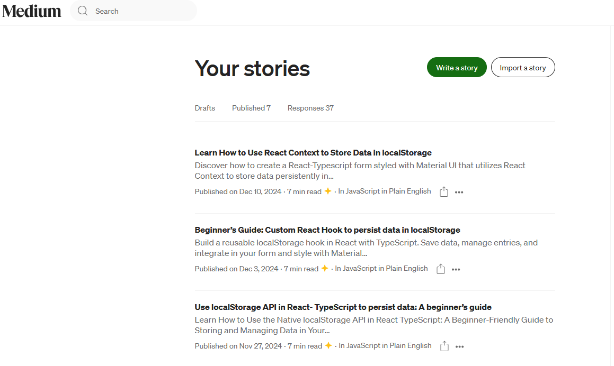

# LocalStorage in React-Typescript

This respository consists of 3 other sub-repositories which each belongs to one article published on [Medium](https://medium.com/@SevdaSevinu).

1- [Use localStorage API in React- TypeScript to persist data: A beginner’s guide](https://medium.com/javascript-in-plain-english/4-ways-to-use-localstorage-in-react-typescript-part-1-4671460ac2b2)

2- [Beginner’s Guide: Custom React Hook to persist data in localStorage](https://medium.com/javascript-in-plain-english/4-ways-to-use-localstorage-in-react-typescript-part-2-custom-hook-136dc43b3280)

3- [Learn How to Use React Context to Store Data in localStorage](https://medium.com/javascript-in-plain-english/learn-how-to-use-react-context-to-store-data-in-localstorage-33d84ff104cd)
