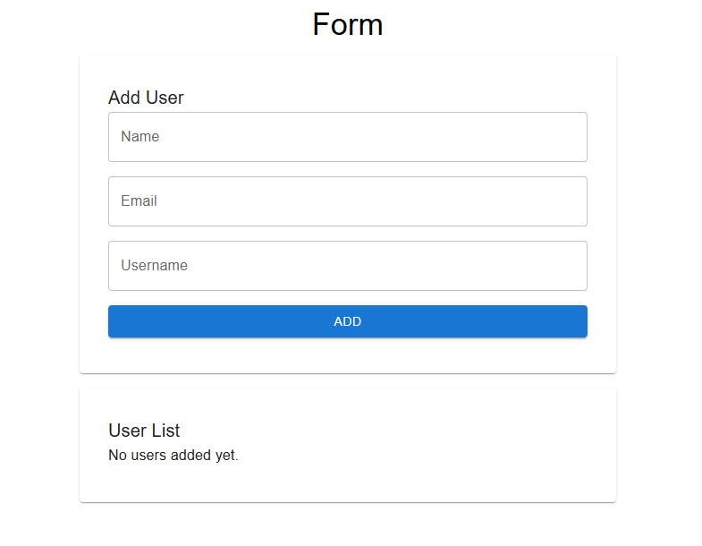
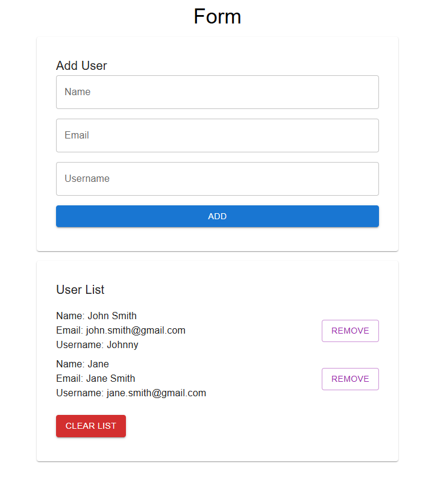

# Learn How to Use React Context to Store Data in localStorage

This project was primarily built for a Medium article and published in JavaScript in Plain Language publication, you can check the article here:

- https://medium.com/javascript-in-plain-english/learn-how-to-use-react-context-to-store-data-in-localstorage-33d84ff104cd

## Overview

This is a simple app where users can submit their name and email and username through a form. Then submitted data will be stored in localStorage using a React Context. Users will also have the ability to remove individual entries or clear all stored data.

