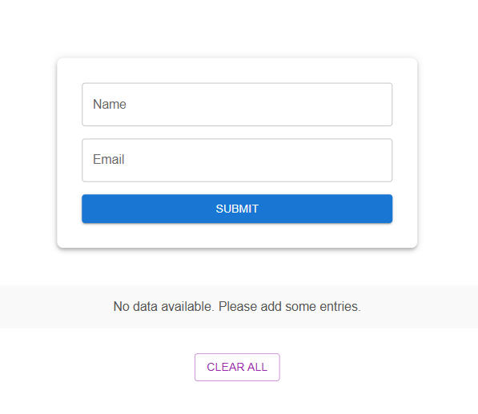
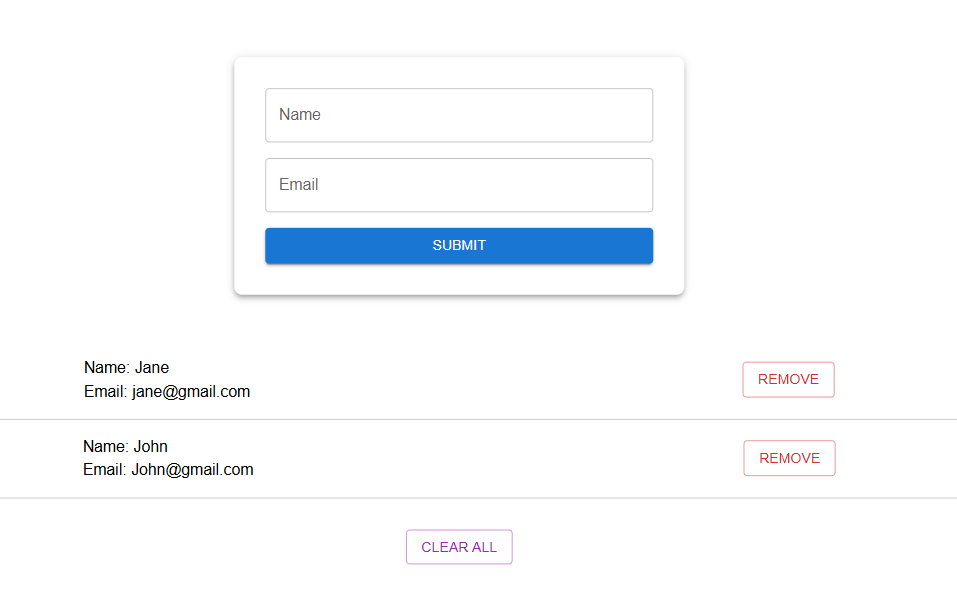

# Build a reusable localStorage hook in React with TypeScript.

This project was primarily built for a Medium article and published in **JavaScript in Plain Language** publication, you can check the article here:

- [4 Ways to Use localStorage in React-TypeScript: Part 2- Custom Hook](https://medium.com/javascript-in-plain-english/4-ways-to-use-localstorage-in-react-typescript-part-2-custom-hook-136dc43b3280)

## Overview

This is a simple app where users can submit their name and email through a form. The submitted data will be stored in localStorage using a custom hook. Users will also have the ability to remove individual entries or clear all stored data.

This project was bootstrapped with [Create React App](https://github.com/facebook/create-react-app) and Typescript template.

In the project directory, you can run:

### `npm start`

Runs the app in the development mode.\
Open [http://localhost:3000](http://localhost:3000) to view it in the browser.
