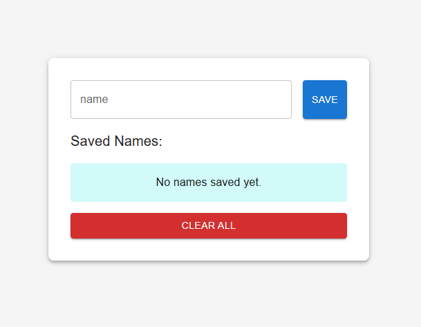
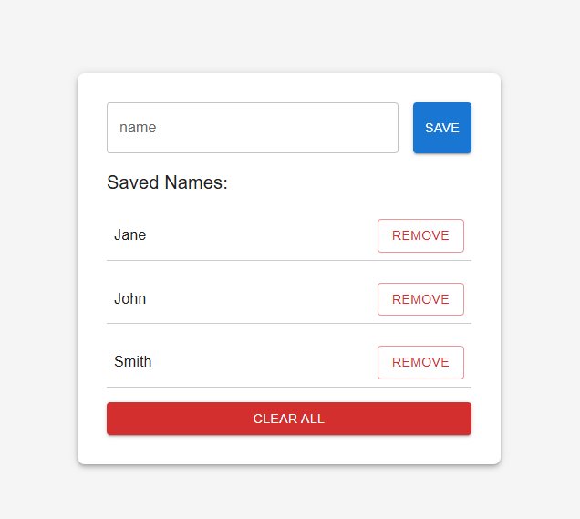

# 4 Ways to Use localStorage in React- TypeScript (Part 1)

Learn How to Use the Native localStorage API in React TypeScript: A Beginner-Friendly Guide to Storing and Managing Data in Your Applications.

## Install

Please ensure you have node and npm installed in your system. Fork the project and create repository in your computer. Open the folder in your code editor and run npm start .

